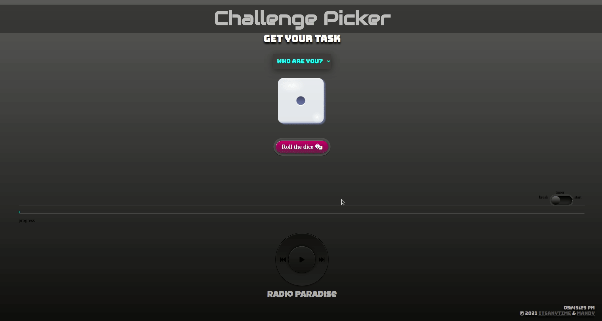
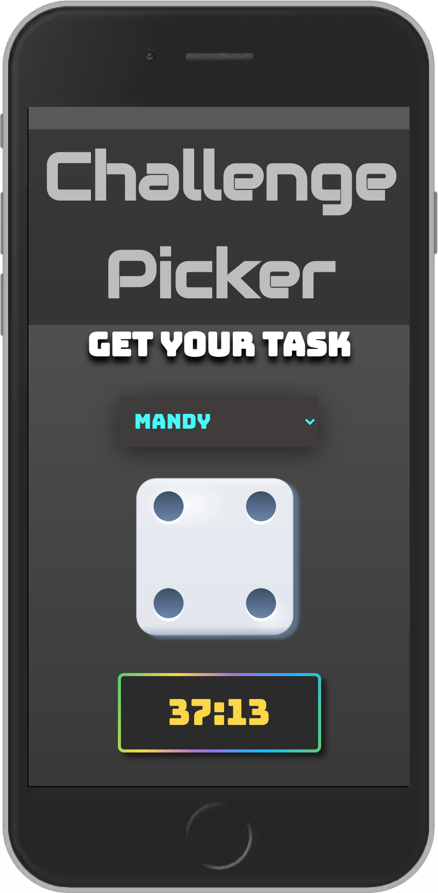
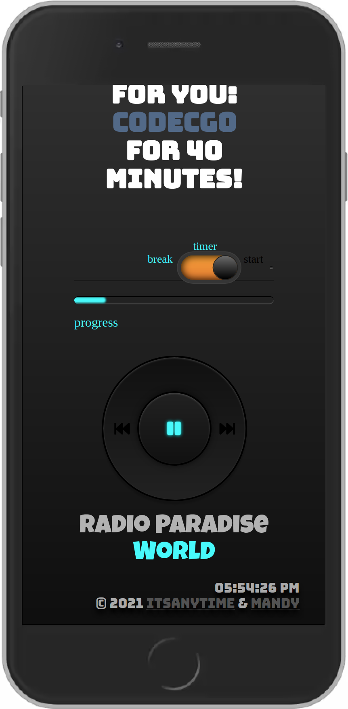

## Coding Challenge Picker

This project was created together with [Any](https://github.com/itsAnyTime), while on a web development course @ the Digital Career Institute. The purpose of this project was to practice collaborating via GitHub Projects.

**Build with:**  

<code></code>
<code></code>
<code></code>

[Live Demo](https://challenge-picker.netlify.app/#) 

 
